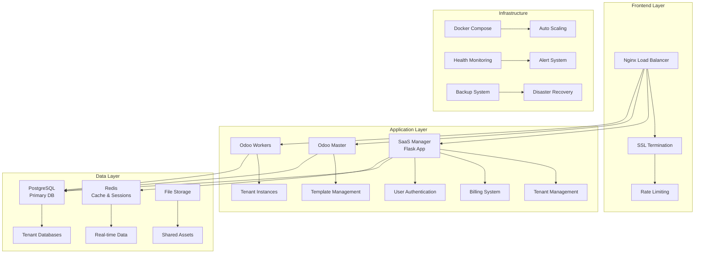

# 🚀 Odoo Multi-Tenant SaaS Platform

[](https://www.docker.com/)
[](https://www.python.org/)
[](https://www.odoo.com/)
[](LICENSE)

> 🌟 **A complete, production-ready Multi-Tenant Odoo SaaS platform with automated billing, scaling, and tenant management**

## 📋 Table of Contents

- [🎯 Overview](#-overview)
- [🏗️ Architecture](#️-architecture)
- [🛠️ Technology Stack](#️-technology-stack)
- [✨ Features](#-features)
- [🚀 Quick Start](#-quick-start)
- [📈 Scaling & Performance](#-scaling--performance)
- [💼 Business & Marketing](#-business--marketing)
- [🎯 Target Market](#-target-market)
- [💰 Monetization Strategy](#-monetization-strategy)
- [📊 SWOT Analysis](#-swot-analysis)
- [🧠 Marketing Psychology](#-marketing-psychology)
- [🌍 Market Position](#-market-position)
- [📚 Documentation](#-documentation)
- [🤝 Contributing](#-contributing)

## 🎯 Overview

**Odoo Multi-Tenant SaaS Platform** is a sophisticated, enterprise-grade solution that transforms Odoo into a powerful SaaS offering. It provides automated tenant provisioning, intelligent billing management, horizontal scaling, and comprehensive administrative controls - all wrapped in a user-friendly interface.

### 🌟 What Makes Us Different

- **🔄 Instant Provisioning**: Zero-downtime tenant creation in under 2 minutes
- **💳 Integrated Billing**: SSLCommerz payment gateway with automated billing cycles
- **📈 Auto-Scaling**: Intelligent worker scaling based on real-time load
- **🛡️ Enterprise Security**: Multi-layer security with SSL, rate limiting, and audit trails
- **🎨 White-Label Ready**: Complete branding customization capabilities
- **📊 Real-time Analytics**: Comprehensive tenant and system monitoring

## 🏗️ Architecture

### System Components



### 🔄 Multi-Tenant Architecture

- **Shared Infrastructure**: Cost-effective resource utilization
- **Isolated Databases**: Complete data separation per tenant
- **Load Balancing**: Intelligent request distribution
- **Auto-Scaling**: Dynamic worker allocation based on demand

## 🛠️ Technology Stack

### Backend Technologies
- **🐍 Python 3.9+**: Core application development
- **🌶️ Flask 3.0**: Web framework with extensive ecosystem
- **🐘 PostgreSQL 15**: Primary database with multi-tenancy support
- **⚡ Redis 7**: Caching, sessions, and real-time features
- **🐳 Docker**: Containerization and orchestration
- **🌐 Nginx**: High-performance reverse proxy and load balancer

### Frontend & UI
- **📱 Bootstrap 5**: Responsive, mobile-first design
- **⚡ jQuery**: Dynamic UI interactions
- **📊 Chart.js**: Real-time analytics and dashboards
- **🎨 Custom CSS**: Branded, professional interface

### DevOps & Infrastructure
- **🐳 Docker Compose**: Multi-container orchestration
- **🔧 Bash Scripts**: Automated deployment and scaling
- **📈 Health Checks**: Comprehensive monitoring system
- **🔒 SSL/TLS**: Security with Let's Encrypt support
- **📦 Automated Backups**: Scheduled data protection

### Payment & Billing
- **💳 SSLCommerz**: Secure payment processing
- **💰 Automated Billing**: Usage-based billing cycles
- **📊 Financial Reporting**: Revenue analytics and insights

## ✨ Features

### 🎯 Core Features

#### 🏢 Multi-Tenant Management
- **Instant Provisioning**: Automated tenant creation with custom subdomains
- **Resource Isolation**: Complete separation of tenant data and configurations
- **Custom Branding**: White-label capabilities with logo and theme customization
- **Usage Monitoring**: Real-time tracking of tenant resource consumption

#### 💳 Integrated Billing System
- **Automated Payments**: SSLCommerz integration with multiple payment methods
- **Flexible Plans**: Customizable subscription tiers and pricing models
- **Billing Cycles**: Automated 30-day cycles with prorated billing
- **Financial Analytics**: Comprehensive revenue and payment reporting

#### 📈 Auto-Scaling Infrastructure
- **Dynamic Workers**: Automatic scaling from 2-10 worker instances
- **Load Monitoring**: Real-time CPU and memory usage tracking
- **Health Checks**: Automated failure detection and recovery
- **Performance Optimization**: Intelligent load distribution

#### 🛡️ Enterprise Security
- **SSL/TLS Encryption**: End-to-end secure communications
- **Rate Limiting**: DDoS protection and abuse prevention
- **Audit Logging**: Comprehensive activity tracking
- **Access Control**: Role-based permissions and authentication

### 🚀 Advanced Features

#### 🎨 Customization Engine
- **Theme Management**: Dynamic CSS and branding updates
- **Module Marketplace**: Extensible addon ecosystem
- **API Integration**: RESTful APIs for third-party integrations
- **Webhook Support**: Real-time event notifications

#### 📊 Analytics & Reporting
- **Real-time Dashboards**: Live system and tenant metrics
- **Business Intelligence**: Revenue, usage, and growth analytics
- **Export Capabilities**: Data export in multiple formats
- **Custom Reports**: Configurable reporting templates

#### 🔧 Development Tools
- **CLI Tools**: Command-line management utilities
- **Testing Framework**: Automated testing and validation
- **Development Mode**: Hot-reload and debugging capabilities
- **Documentation**: Comprehensive API and setup guides

## 🚀 Quick Start

### Prerequisites

- **Docker 20.10+** and **Docker Compose**
- **4GB+ RAM** (8GB recommended for production)
- **20GB+ Disk Space** (50GB+ for production)
- **Linux/macOS/Windows** with WSL2

### 🐳 One-Click Deployment

```bash
# Clone the repository
git clone https://github.com/tovfikur/odoo-multi-tenant-system.git
cd odoo-multi-tenant-system

# Run automated deployment
chmod +x scripts/deploy.sh
./scripts/deploy.sh --with-ssl

# Access your platform
open http://localhost        # SaaS Manager
open http://localhost:8069   # Odoo Master
```

### 🔧 Manual Setup

```bash
# 1. Configure environment
cp .env.example .env
nano .env  # Edit with your settings

# 2. Start services
docker-compose up -d

# 3. Initialize system
docker-compose exec saas_manager python init_db.py

# 4. Access services
echo "SaaS Manager: http://localhost:8000"
echo "Odoo Master: http://localhost:8069"
```

### 📋 Environment Configuration

```bash
# Database Settings
POSTGRES_PASSWORD=your_secure_password
ODOO_MASTER_PASSWORD=admin_password

# SSL Configuration
USE_SSL=true
DOMAIN=yourdomain.com
EMAIL=admin@yourdomain.com

# Scaling Limits
MIN_WORKERS=2
MAX_WORKERS=10
LOAD_THRESHOLD=80
```

## 📈 Scaling & Performance

### 🔄 Horizontal Scaling

#### Auto-Scaling Configuration
```bash
# Configure auto-scaling parameters
MIN_WORKERS=2          # Minimum worker instances
MAX_WORKERS=10         # Maximum worker instances  
LOAD_THRESHOLD=80      # CPU threshold for scaling up
SCALE_DOWN_THRESHOLD=30 # CPU threshold for scaling down
```

#### Manual Scaling Operations
```bash
# Scale up workers
./scripts/scale.sh scale-up 5

# Scale down workers  
./scripts/scale.sh scale-down 3

# Auto-scale based on load
./scripts/scale.sh auto-scale

# Monitor worker status
./scripts/scale.sh status
```

### 🚀 Performance Optimization

#### Database Optimization
- **Connection Pooling**: 200 max connections with optimized pool
- **Shared Buffers**: 256MB for improved query performance
- **Query Optimization**: Automated query analysis and optimization
- **Index Management**: Automatic index creation and maintenance

#### Caching Strategy
- **Redis Caching**: Session management and frequently accessed data
- **HTTP Caching**: Static asset caching with CDN support
- **Database Caching**: Query result caching for improved response times
- **Application Caching**: In-memory caching for business logic

#### Infrastructure Improvements Needed

##### 🎯 Current Limitations & Solutions

1. **Container Orchestration**
   - **Current**: Docker Compose (single-host)
   - **Improvement**: Kubernetes cluster with auto-scaling pods
   - **Benefit**: True multi-host scaling, better resource management

2. **Database Clustering**
   - **Current**: Single PostgreSQL instance
   - **Improvement**: PostgreSQL cluster with read replicas
   - **Benefit**: Higher availability, better read performance

3. **Load Balancing**
   - **Current**: Nginx reverse proxy
   - **Improvement**: HAProxy or cloud load balancer with health checks
   - **Benefit**: Better traffic distribution, failover capabilities

4. **Monitoring & Observability**
   - **Current**: Basic health checks
   - **Improvement**: Prometheus + Grafana + ELK stack
   - **Benefit**: Advanced metrics, alerting, log aggregation

5. **Storage & Backup**
   - **Current**: Local file storage
   - **Improvement**: Distributed storage (Ceph, GlusterFS) + S3 backups
   - **Benefit**: High availability, disaster recovery

##### 📊 Scaling Roadmap

| Stage | Users | Architecture | Infrastructure |
|-------|--------|-------------|---------------|
| **Startup** | 0-100 | Single server, Docker Compose | 4 CPU, 8GB RAM, 100GB SSD |
| **Growth** | 100-1K | Multi-server, Kubernetes | 3 nodes, 8 CPU, 16GB RAM each |
| **Scale** | 1K-10K | Microservices, Auto-scaling | 5-20 nodes, auto-scaling groups |
| **Enterprise** | 10K+ | Multi-region, Edge caching | Global CDN, multi-zone deployment |

## 💼 Business & Marketing

### 🎯 Value Proposition

**"Transform Your Business with Enterprise Odoo in Minutes, Not Months"**

#### Core Value Drivers
1. **⚡ Speed to Market**: Launch in 2 minutes vs 2 months traditional setup
2. **💰 Cost Efficiency**: 70% cost reduction compared to traditional ERP implementation
3. **🔧 Zero Maintenance**: Fully managed infrastructure and updates
4. **📈 Scalability**: Grow from startup to enterprise seamlessly
5. **🛡️ Enterprise Security**: Bank-level security without the complexity

## 🎯 Target Market

### 🏢 Primary Customer Segments

#### 1. **SME Digital Agencies** (Primary Target)
- **Profile**: 10-50 employees, serving multiple clients
- **Pain Points**: Client demands for separate ERP instances, high setup costs
- **Solution Fit**: Multi-tenant architecture, white-label capabilities
- **Value**: $500-2000/month vs $10,000+ traditional setup

#### 2. **SaaS Entrepreneurs** (High Growth Potential)
- **Profile**: Tech-savvy founders building ERP-adjacent solutions
- **Pain Points**: Building ERP from scratch, time to market
- **Solution Fit**: White-label platform, API integrations
- **Value**: 6-month faster launch, focus on core differentiators

#### 3. **Enterprise IT Departments** (High Value)
- **Profile**: Large corporations, 500+ employees
- **Pain Points**: Complex Odoo deployments, multiple subsidiaries
- **Solution Fit**: Enterprise scaling, security compliance
- **Value**: Reduced IT overhead, faster subsidiary onboarding

#### 4. **Odoo Implementation Partners** (Channel Partners)
- **Profile**: Certified Odoo partners, consultancies
- **Pain Points**: Client infrastructure management, scaling challenges
- **Solution Fit**: Managed hosting, partner program
- **Value**: Focus on implementation, not infrastructure

### 🌍 Geographic Markets

#### Primary Markets
- **North America**: High SaaS adoption, enterprise budgets
- **Europe**: GDPR compliance, Odoo popularity
- **Asia-Pacific**: Rapid SME growth, digital transformation

#### Market Entry Strategy
1. **Phase 1**: English-speaking markets (US, UK, Australia)
2. **Phase 2**: European expansion (Germany, France, Netherlands)
3. **Phase 3**: Asia-Pacific growth (Singapore, India, Australia)

## 💰 Monetization Strategy

### 🎯 Revenue Models

#### 1. **Subscription Tiers** (Primary Revenue)

| Plan | Price/Month | Users | Storage | Features |
|------|------------|-------|---------|----------|
| **Starter** | $49 | 5 | 5GB | Basic modules, Email support |
| **Professional** | $149 | 25 | 50GB | Advanced modules, Phone support |
| **Enterprise** | $399 | 100 | 200GB | All modules, Dedicated support |
| **White-Label** | $999 | Unlimited | 1TB | Custom branding, API access |

#### 2. **Usage-Based Pricing** (Secondary Revenue)
- **Storage Overage**: $0.10/GB/month
- **API Calls**: $0.001 per call above limit
- **Additional Users**: $5/user/month
- **Premium Modules**: $10-50/module/month

#### 3. **Service Revenue** (High Margin)
- **Setup & Migration**: $500-5,000 per project
- **Custom Development**: $100-200/hour
- **Training & Consulting**: $150/hour
- **Priority Support**: $200/month

#### 4. **Partner Program** (Scalable Revenue)
- **Referral Commission**: 20% first year revenue
- **Reseller Margin**: 30-40% recurring revenue
- **Implementation Partners**: Revenue sharing model

### 📊 Financial Projections

#### Year 1-3 Revenue Forecast
```
Year 1: $240K ARR
- 100 Starter customers ($49 × 12 × 100)
- 20 Professional customers ($149 × 12 × 20) 
- 5 Enterprise customers ($399 × 12 × 5)

Year 2: $960K ARR
- 400 customers across all tiers
- Average ACO of $200/month

Year 3: $2.4M ARR
- 1,000 customers
- Higher tier migration
- Service revenue: $500K
```

## 📊 SWOT Analysis

### 💪 Strengths

#### Technical Strengths
- **🚀 Modern Architecture**: Containerized, microservices-ready
- **⚡ Performance**: Auto-scaling, optimized database queries
- **🛡️ Security**: Enterprise-grade security features
- **🔧 Automation**: Minimal manual intervention required

#### Business Strengths  
- **📈 Market Timing**: Growing SaaS adoption, remote work trends
- **💰 Recurring Revenue**: Subscription-based, predictable income
- **🌍 Global Market**: Addressable market of $50B+ ERP industry
- **🤝 Partner Ecosystem**: Leverage existing Odoo community

### ⚠️ Weaknesses

#### Technical Limitations
- **🏗️ Infrastructure**: Currently limited to single-server deployment
- **📊 Monitoring**: Basic monitoring, needs advanced observability
- **🔄 Updates**: Manual Odoo version updates
- **📱 Mobile**: Limited mobile optimization

#### Business Challenges
- **💼 Sales Team**: Need experienced SaaS sales professionals
- **📈 Marketing**: Limited brand recognition in competitive market
- **💰 Capital**: Infrastructure scaling requires significant investment
- **🎯 Focus**: Feature scope may be too broad initially

### 🚀 Opportunities

#### Market Opportunities
- **📊 Market Growth**: ERP SaaS market growing 15% annually
- **🌐 Remote Work**: Increased demand for cloud-based solutions
- **🏢 SME Digital**: Small businesses embracing digital transformation
- **🌍 Global Expansion**: Untapped markets in developing countries

#### Technical Opportunities
- **🤖 AI Integration**: Machine learning for business insights
- **📱 Mobile-First**: Native mobile applications
- **🔗 Integrations**: Marketplace for third-party integrations
- **🎨 No-Code**: Visual workflow builder for non-technical users

### ⚡ Threats

#### Competitive Threats
- **🏢 Enterprise Players**: SAP, Oracle with unlimited resources
- **☁️ Cloud Giants**: AWS, Google Cloud entering ERP space
- **🚀 VC-Backed Startups**: Well-funded competitors with aggressive pricing
- **🔄 Open Source**: Free alternatives gaining traction

#### Technical Threats
- **🔒 Security Breaches**: Potential data breaches affecting reputation
- **📉 Downtime**: Service interruptions causing customer churn
- **⚖️ Compliance**: Changing regulations (GDPR, SOC2)
- **🔧 Technical Debt**: Rapid growth leading to stability issues

## 🧠 Marketing Psychology

### 🎯 Psychological Triggers

#### 1. **Urgency & Scarcity**
- **Limited Time Offers**: "50% off first 3 months - Limited time!"
- **Capacity Scarcity**: "Only 100 spots remaining in our beta program"
- **Feature Scarcity**: "Advanced analytics available to first 500 customers"

#### 2. **Social Proof & Authority**
- **Customer Testimonials**: Video cases from successful implementations
- **Expert Endorsements**: Odoo community leaders and consultants
- **Usage Statistics**: "Join 10,000+ businesses already using our platform"
- **Certifications**: SOC2, ISO 27001 compliance badges

#### 3. **Loss Aversion**
- **Risk-Free Trials**: "30-day money-back guarantee, cancel anytime"
- **Migration Insurance**: "We guarantee successful migration or full refund"
- **Downtime Protection**: "99.9% uptime SLA with service credits"

#### 4. **Anchoring & Price Psychology**
- **High Anchor Pricing**: Show enterprise price first ($999), then highlight professional ($149)
- **Cost Comparison**: "Traditional Odoo setup: $50,000+ vs Our solution: $149/month"
- **ROI Calculators**: Interactive tools showing cost savings

### 🎨 Brand Positioning

#### Brand Personality
- **💪 Reliable**: "The dependable choice for growing businesses"
- **🚀 Innovative**: "Cutting-edge technology made simple"
- **🤝 Supportive**: "Your partner in digital transformation"
- **🎯 Focused**: "Purpose-built for modern businesses"

#### Messaging Framework
```
Primary Message: "Enterprise Odoo in 2 minutes, not 2 months"
Supporting Messages:
- Speed: "Go live instantly"
- Simplicity: "No technical expertise required" 
- Security: "Bank-level security built-in"
- Scalability: "Grows with your business"
```

### 📢 Customer Journey Psychology

#### 1. **Awareness Stage** (Problem Recognition)
- **Content Strategy**: "Hidden costs of traditional ERP implementation"
- **Emotional Trigger**: Frustration with current systems
- **Content Types**: Blog posts, webinars, ROI calculators

#### 2. **Consideration Stage** (Solution Evaluation)
- **Social Proof**: Customer case studies and demos
- **Emotional Trigger**: Fear of making wrong choice
- **Content Types**: Comparison guides, free trials, expert webinars

#### 3. **Decision Stage** (Purchase Decision)
- **Urgency**: Limited-time offers and bonuses
- **Emotional Trigger**: Excitement about transformation
- **Content Types**: Consultations, demos, migration assistance

#### 4. **Retention Stage** (Success & Expansion)
- **Success Focus**: Celebrate customer wins
- **Emotional Trigger**: Pride in achievements
- **Content Types**: Success stories, training, upsell opportunities

### 🎯 Conversion Optimization

#### Landing Page Psychology
- **Headline Formula**: [Specific Outcome] + [Time Frame] + [Social Proof]
  - "Launch Your Odoo ERP in 2 Minutes - Join 5,000+ Businesses"
- **Trust Signals**: Security badges, testimonials, guarantee
- **Cognitive Load Reduction**: Single clear call-to-action per page
- **Loss Aversion**: "Don't let competitors get ahead - Start free trial"

#### Pricing Page Psychology
- **Price Anchoring**: Show highest plan first
- **Feature Comparison**: Highlight value differences clearly
- **Urgency**: "Limited time: 50% off professional plan"
- **Social Proof**: "Most popular" badges on recommended plans

## 🌍 Market Position

### 🏆 Competitive Landscape

#### Direct Competitors

##### 1. **Salesforce (High-End Competitor)**
- **Strengths**: Brand recognition, enterprise features, ecosystem
- **Weaknesses**: High cost ($150+/user), complexity, long implementation
- **Our Advantage**: Lower cost, faster deployment, Odoo-specific expertise

##### 2. **NetSuite (Oracle) (Enterprise Competitor)**
- **Strengths**: Comprehensive features, Oracle backing, enterprise focus
- **Weaknesses**: High cost ($99+/user), complex setup, rigid customization
- **Our Advantage**: Flexibility, cost-effectiveness, easier customization

##### 3. **Zoho One (Feature Competitor)**
- **Strengths**: Integrated suite, competitive pricing, good SME focus
- **Weaknesses**: Limited ERP depth, Indian market focus, integration challenges
- **Our Advantage**: Deeper ERP functionality, better localization, Odoo ecosystem

#### Indirect Competitors

##### 1. **Traditional Odoo Hosting**
- **Players**: Odoo.sh, OdooCloud, various hosting providers
- **Limitations**: Single-tenant, manual setup, limited SaaS features
- **Our Advantage**: Multi-tenancy, automated billing, management tools

##### 2. **Custom ERP Development**
- **Alternative**: Building custom ERP solutions
- **Limitations**: High cost, long timeline, maintenance burden
- **Our Advantage**: Faster deployment, lower cost, proven solution

### 🎯 Differentiation Strategy

#### 1. **Technology Differentiation**
- **Multi-Tenant Architecture**: Unique in Odoo ecosystem
- **Auto-Scaling**: Dynamic resource allocation
- **Integrated Billing**: Built-in payment and subscription management
- **Developer-Friendly**: APIs, webhooks, extensibility

#### 2. **Market Differentiation**
- **Odoo Specialization**: Deep expertise in Odoo ecosystem
- **SME Focus**: Purpose-built for small-medium enterprises
- **Partner-Friendly**: Channel program for implementation partners
- **Vertical Solutions**: Industry-specific configurations

#### 3. **Business Model Differentiation**
- **Usage-Based Pricing**: Pay for what you use
- **No Setup Fees**: Instant activation without upfront costs
- **Flexible Contracts**: Monthly billing, easy cancellation
- **Success-Based Pricing**: Pricing tied to customer success metrics

### 📈 Go-to-Market Strategy

#### Phase 1: Market Entry (Months 1-6)
- **Target**: Early adopters, beta customers
- **Channels**: Direct sales, content marketing, Odoo community
- **Goals**: 100 paying customers, product-market fit validation
- **Budget**: $50K marketing, focus on content and partnerships

#### Phase 2: Growth (Months 7-18)
- **Target**: SME market expansion, partner channel development
- **Channels**: Partner program, paid advertising, events
- **Goals**: 1,000 customers, $1M ARR
- **Budget**: $200K marketing, sales team hiring

#### Phase 3: Scale (Months 19-36)
- **Target**: Enterprise segment, international expansion
- **Channels**: Enterprise sales, international partners, PR
- **Goals**: 5,000 customers, $5M ARR
- **Budget**: $500K marketing, international offices

### 🤝 Partnership Strategy

#### 1. **Odoo Partner Program**
- **Target**: Certified Odoo implementation partners
- **Value Prop**: Managed hosting solution for their clients
- **Revenue Share**: 30% recurring commission
- **Support**: Training, marketing materials, co-selling

#### 2. **Technology Partners**
- **Target**: Complementary SaaS providers (CRM, marketing tools)
- **Integration**: API-based integrations and marketplaces
- **Value**: Expanded feature set, customer retention
- **Revenue**: Revenue sharing on joint customers

#### 3. **Channel Partners**
- **Target**: IT consultants, system integrators
- **Program**: Reseller program with training and certification
- **Support**: Sales tools, technical support, marketing funds
- **Commission**: 40% first-year, 20% recurring

## 📚 Documentation

### 🔧 Technical Documentation

#### API Reference
```bash
# Get tenant information
GET /api/v1/tenants/{tenant_id}

# Create new tenant
POST /api/v1/tenants
{
  "name": "Company Name",
  "subdomain": "company",
  "plan": "professional"
}

# Update billing plan
PUT /api/v1/tenants/{tenant_id}/plan
{
  "plan": "enterprise"
}
```

#### Configuration Guide
- [Environment Variables](docs/environment.md)
- [SSL Setup](docs/ssl-setup.md)
- [Scaling Configuration](docs/scaling.md)
- [Backup & Recovery](docs/backup.md)

#### Deployment Guides
- [Docker Deployment](docs/docker-deployment.md)
- [Kubernetes Deployment](docs/kubernetes.md)
- [Production Checklist](docs/production.md)
- [Monitoring Setup](docs/monitoring.md)

### 📖 User Documentation

#### Getting Started
- [Quick Start Guide](docs/quick-start.md)
- [Tenant Creation](docs/tenant-management.md)
- [Billing Management](docs/billing.md)
- [User Management](docs/user-management.md)

#### Administrator Guides
- [System Administration](docs/admin/system.md)
- [Infrastructure Management](docs/admin/infrastructure.md)
- [Security Configuration](docs/admin/security.md)
- [Performance Tuning](docs/admin/performance.md)

#### Developer Resources
- [API Documentation](docs/api/README.md)
- [Custom Module Development](docs/development/modules.md)
- [Integration Guide](docs/development/integrations.md)
- [Testing Framework](docs/development/testing.md)

## 🤝 Contributing

We welcome contributions from the community! Please read our [Contributing Guide](CONTRIBUTING.md) for details on how to get started.

### 🛠️ Development Setup

```bash
# Fork and clone the repository
git clone https://github.com/yourusername/odoo-multi-tenant-system.git
cd odoo-multi-tenant-system

# Set up development environment
./scripts/dev-setup.sh

# Run tests
docker-compose -f docker-compose.test.yml up --build

# Start development server
docker-compose -f docker-compose.dev.yml up
```

### 📋 Code of Conduct

Please note that this project is released with a [Contributor Code of Conduct](CODE_OF_CONDUCT.md). By participating in this project you agree to abide by its terms.

### 🐛 Bug Reports & Feature Requests

- **Bug Reports**: [GitHub Issues](https://github.com/tovfikur/odoo-multi-tenant-system/issues)
- **Feature Requests**: [GitHub Discussions](https://github.com/tovfikur/odoo-multi-tenant-system/discussions)
- **Security Issues**: security@yourdomain.com

## 📞 Support & Community

### 💬 Community Channels
- **Discord**: [Join our community](https://discord.gg/odoo-saas)
- **Forum**: [Community Forum](https://forum.yourdomain.com)
- **Newsletter**: [Monthly updates](https://newsletter.yourdomain.com)

### 🆘 Professional Support
- **Email**: support@yourdomain.com
- **Enterprise Support**: enterprise@yourdomain.com
- **Emergency Support**: +1-800-ODOO-HELP

### 📅 Roadmap

#### Q1 2024
- [ ] Kubernetes deployment support
- [ ] Advanced monitoring dashboard
- [ ] Mobile application beta

#### Q2 2024
- [ ] Multi-region deployment
- [ ] AI-powered analytics
- [ ] Marketplace for custom modules

#### Q3 2024
- [ ] Enterprise SSO integration
- [ ] Advanced backup & disaster recovery
- [ ] WhiteLabel marketplace

---

<div align="center">

**🚀 Ready to Transform Your Business?**

[**Start Free Trial**](https://yourdomain.com/trial) | [**Schedule Demo**](https://yourdomain.com/demo) | [**Contact Sales**](https://yourdomain.com/contact)

---

**Made with ❤️ by the Odoo SaaS Team**

[](https://github.com/tovfikur/odoo-multi-tenant-system)
[](https://twitter.com/yourusername)

</div>
