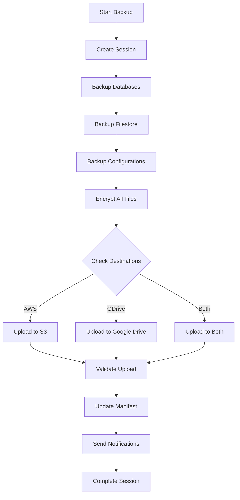

# Enhanced Disaster Recovery Features

## 🚀 New Features Overview

The disaster recovery system has been enhanced with **Google Drive integration** and a **web-based Backup Panel** for comprehensive backup management.

### 🆕 What's New

1. **Multiple Backup Destinations** - Store backups in both AWS S3 and Google Drive
2. **Web-based Management Panel** - User-friendly interface for backup operations
3. **Real-time Monitoring** - Live backup status and storage usage tracking
4. **Enhanced Security** - OAuth2 authentication for Google Drive
5. **Improved Automation** - Scheduled backups with multiple destinations

---

## 📱 Backup Panel Features

### Web Interface Access
- **URL**: `http://localhost:5000` or `https://backup.yourdomain.com`
- **Default Login**: `admin` / `admin` (change after first login)
- **Mobile Responsive**: Works on desktop, tablet, and mobile devices

### Dashboard Features
- **System Status Overview** - Real-time service health monitoring
- **Storage Usage Charts** - Visual representation of AWS S3 and Google Drive usage
- **Recent Backup History** - Quick access to latest backup sessions
- **Quick Actions** - Start backup, validate, and system controls

### Backup Management
- **Manual Backup Triggers** - Start backups with custom destination selection
- **Backup History** - Detailed view of all backup sessions with filtering
- **Backup Validation** - Test backup integrity and recoverability
- **Storage Analytics** - Track storage usage across all destinations

### Configuration Management
- **Multi-destination Setup** - Configure AWS S3 and Google Drive simultaneously
- **Notification Settings** - Email and Slack integration for alerts
- **Retention Policies** - Customize backup retention for different storage types
- **Security Settings** - Manage encryption and access controls

---

## 🗂️ Google Drive Integration

### Setup Requirements

1. **Google Cloud Console Setup**:
   ```bash
   # 1. Visit: https://console.cloud.google.com/
   # 2. Create/select project
   # 3. Enable Google Drive API
   # 4. Create OAuth2 credentials (Desktop application)
   # 5. Note Client ID and Client Secret
   ```

2. **Configuration Update**:
   ```bash
   # Edit dr-config.env
   GDRIVE_CLIENT_ID="your-client-id.googleusercontent.com"
   GDRIVE_CLIENT_SECRET="your-client-secret"
   GDRIVE_FOLDER_NAME="DR-Backups"
   ```

3. **Python Dependencies**:
   ```bash
   pip install google-auth google-auth-oauthlib google-api-python-client tenacity
   ```

### Features

- **OAuth2 Authentication** - Secure access using Google's OAuth2 flow
- **Automatic Folder Creation** - Creates dedicated backup folder in Google Drive
- **Chunked Uploads** - Efficient upload of large backup files
- **Retry Logic** - Automatic retry with exponential backoff for failed uploads
- **Storage Quotas** - Real-time storage usage and quota monitoring
- **File Versioning** - Leverages Google Drive's built-in versioning

### Usage Examples

```bash
# Manual Google Drive operations
python3 scripts/gdrive-integration.py --authenticate
python3 scripts/gdrive-integration.py --upload /path/to/backup.enc
python3 scripts/gdrive-integration.py --list
python3 scripts/gdrive-integration.py --storage
python3 scripts/gdrive-integration.py --cleanup 30
```

### Storage Lifecycle

| Stage | Location | Retention | Cost |
|-------|----------|-----------|------|
| **Active** | Google Drive | 90 days | Standard rates |
| **Archive** | Manual cleanup | User controlled | N/A |
| **Cleanup** | Automated | Configurable | N/A |

---

## 🎛️ Multi-Destination Backup Configuration

### Destination Options

1. **AWS S3 Only**:
   ```bash
   DR_BACKUP_DESTINATIONS="aws"
   ```

2. **Google Drive Only**:
   ```bash
   DR_BACKUP_DESTINATIONS="gdrive"
   ```

3. **Both Destinations** (Recommended):
   ```bash
   DR_BACKUP_DESTINATIONS="aws,gdrive"
   ```

### Backup Flow with Multiple Destinations



### Configuration Matrix

| Feature | AWS S3 | Google Drive | Both |
|---------|--------|--------------|------|
| **Storage Cost** | Pay per GB | 15GB free, then paid | Combined costs |
| **Upload Speed** | Fast | Moderate | Parallel uploads |
| **Reliability** | 99.999999999% | 99.9% | Maximum redundancy |
| **API Limits** | High | Moderate | Distributed load |
| **Setup Complexity** | Medium | Medium | Medium |

---

## 🖥️ Backup Panel Installation

### Method 1: Docker (Recommended)

```bash
# Build and start the backup panel
docker-compose up backup_panel

# Access the panel
open http://localhost:5000
```

### Method 2: Standalone Installation

```bash
# Install dependencies
cd dr-backups/backup_panel
pip install -r requirements.txt

# Initialize database
python3 app.py

# Start the application
export FLASK_APP=app.py
flask run --host=0.0.0.0 --port=5000
```

### Method 3: Quick Setup Script

```bash
# Run the enhanced setup script
./dr-backups/setup-enhanced-dr.sh

# Start the panel
./dr-backups/start-backup-panel.sh
```

---

## 🔐 Security Enhancements

### Authentication & Authorization

- **Admin User Management** - Secure login with password hashing
- **Session Management** - Secure session handling with Flask-Login
- **CSRF Protection** - Built-in protection against cross-site request forgery
- **HTTPS Support** - SSL/TLS encryption for web traffic

### Google Drive Security

- **OAuth2 Flow** - Industry-standard authentication
- **Token Refresh** - Automatic token renewal
- **Scoped Permissions** - Minimal required permissions (drive.file)
- **Secure Storage** - Encrypted token storage

### Data Protection

- **AES-256 Encryption** - All backup data encrypted before upload
- **Transport Security** - HTTPS for all cloud communications
- **Access Logging** - Comprehensive audit trails
- **Key Management** - Secure encryption key generation and storage

---

## 📊 Monitoring & Alerting

### Web Dashboard Monitoring

- **Real-time Status** - Live system and backup status
- **Storage Charts** - Visual storage usage across all destinations
- **Backup Timeline** - Historical backup performance
- **Alert Integration** - Email and Slack notifications

### Alert Conditions

| Condition | Severity | Action |
|-----------|----------|--------|
| Backup older than 24h | WARNING | Email notification |
| Backup failure | CRITICAL | Email + Slack alert |
| Storage > 90% full | WARNING | Email notification |
| Service down | CRITICAL | Immediate alert |
| Authentication failure | WARNING | Security notification |

### Notification Channels

1. **Email Notifications**:
   ```bash
   DR_NOTIFICATION_EMAIL="admin@company.com"
   DR_SMTP_HOST="smtp.gmail.com"
   DR_SMTP_PORT="587"
   ```

2. **Slack Integration**:
   ```bash
   DR_WEBHOOK_URL="https://hooks.slack.com/services/YOUR/SLACK/WEBHOOK"
   ```

3. **Web Dashboard Alerts** - Real-time in-app notifications

---

## 🚀 Quick Start Guide

### 1. Install Enhanced Features

```bash
# Run the setup script
cd dr-backups
chmod +x setup-enhanced-dr.sh
./setup-enhanced-dr.sh
```

### 2. Configure Google Drive

```bash
# 1. Get Google Drive credentials from Google Cloud Console
# 2. Update configuration
nano config/dr-config.env

# Set these values:
GDRIVE_CLIENT_ID="your-client-id"
GDRIVE_CLIENT_SECRET="your-client-secret"
DR_BACKUP_DESTINATIONS="aws,gdrive"
```

### 3. Start Backup Panel

```bash
# Option A: Docker
docker-compose up backup_panel

# Option B: Standalone
./start-backup-panel.sh
```

### 4. Access Web Interface

```bash
# Open browser to:
http://localhost:5000

# Login with:
Username: admin
Password: admin

# Change password in Settings!
```

### 5. Run First Enhanced Backup

```bash
# Via web interface: Click "Start Backup"
# Or via command line:
./scripts/enhanced-backup.sh
```

---

## 🔧 Advanced Configuration

### Custom Backup Destinations

```bash
# Configure specific destinations per backup
export DR_BACKUP_DESTINATIONS="aws"          # AWS only
export DR_BACKUP_DESTINATIONS="gdrive"       # Google Drive only
export DR_BACKUP_DESTINATIONS="aws,gdrive"   # Both (default)
```

### Google Drive Advanced Settings

```bash
# Customize upload behavior
GDRIVE_UPLOAD_CHUNK_SIZE="262144"    # 256KB chunks
GDRIVE_FOLDER_NAME="Company-DR-Backups"
GDRIVE_RETRY_ATTEMPTS="3"
```

### Storage Optimization

```bash
# Retention policies
DR_RETENTION_DAYS="90"           # Cloud storage retention
DR_LOCAL_RETENTION_DAYS="7"      # Local backup retention

# Compression settings
DR_COMPRESSION_LEVEL="9"         # Maximum compression
```

### Performance Tuning

```bash
# Parallel operations
DR_MAX_PARALLEL_BACKUPS="3"

# Resource limits
DR_CPU_NICE_LEVEL="19"
DR_IO_NICE_LEVEL="7"
```

---

## 🛠️ Troubleshooting

### Common Issues

1. **Google Drive Authentication Fails**:
   ```bash
   # Clear stored tokens and re-authenticate
   rm -f config/gdrive-token.json
   python3 scripts/gdrive-integration.py --authenticate
   ```

2. **Backup Panel Won't Start**:
   ```bash
   # Check dependencies
   pip install -r backup_panel/requirements.txt
   
   # Check port availability
   netstat -tulpn | grep :5000
   ```

3. **Upload Failures**:
   ```bash
   # Check network connectivity
   curl -I https://www.googleapis.com
   curl -I https://s3.amazonaws.com
   
   # Verify credentials
   aws s3 ls
   python3 scripts/gdrive-integration.py --storage
   ```

### Debug Mode

```bash
# Enable debug logging
export DR_DEBUG_MODE="true"
export DR_VERBOSE_LOGGING="true"

# Run backup with detailed output
./scripts/enhanced-backup.sh
```

### Log Locations

- **Backup Logs**: `dr-backups/logs/backup-*.log`
- **Panel Logs**: `dr-backups/logs/panel-*.log`
- **Google Drive**: `dr-backups/logs/gdrive-*.log`
- **Web Access**: `dr-backups/logs/access.log`

---

## 📈 Performance Metrics

### Backup Performance Comparison

| Destination | Upload Speed | Reliability | Cost Efficiency |
|-------------|-------------|-------------|-----------------|
| **AWS S3** | ⭐⭐⭐⭐⭐ | ⭐⭐⭐⭐⭐ | ⭐⭐⭐⭐ |
| **Google Drive** | ⭐⭐⭐ | ⭐⭐⭐⭐ | ⭐⭐⭐⭐⭐ |
| **Both** | ⭐⭐⭐⭐ | ⭐⭐⭐⭐⭐ | ⭐⭐⭐ |

### Storage Usage Optimization

- **Compression**: 60-80% size reduction
- **Deduplication**: Automatic in Google Drive
- **Lifecycle Management**: Automatic cleanup
- **Cost Tracking**: Real-time usage monitoring

---

## 🎯 Best Practices

### Security Best Practices

1. **Change Default Passwords** - Update admin password immediately
2. **Use HTTPS** - Configure SSL certificates for web panel
3. **Regular Credential Rotation** - Update API keys monthly
4. **Monitor Access Logs** - Review authentication attempts
5. **Backup Encryption Keys** - Secure key storage and backup

### Operational Best Practices

1. **Test Regularly** - Monthly disaster recovery drills
2. **Monitor Storage** - Set up alerts for quota limits
3. **Validate Backups** - Regular backup integrity checks
4. **Document Procedures** - Keep recovery runbooks updated
5. **Train Staff** - Ensure team knows recovery procedures

### Performance Best Practices

1. **Optimize Scheduling** - Stagger backups during low-usage periods
2. **Monitor Resources** - Track CPU and memory usage
3. **Network Optimization** - Use appropriate chunk sizes
4. **Parallel Operations** - Configure concurrent uploads
5. **Regular Cleanup** - Maintain storage efficiency

---

## 🔮 Future Enhancements

### Planned Features

- **Azure Blob Storage** - Additional cloud storage option
- **Real-time Sync** - Continuous backup capabilities
- **Multi-region Support** - Geographic backup distribution
- **Advanced Analytics** - Detailed backup and recovery metrics
- **Mobile App** - iOS/Android backup management

### Integration Roadmap

- **Kubernetes Support** - Container orchestration integration
- **Monitoring Tools** - Grafana and Prometheus integration
- **CI/CD Integration** - Automated backup testing
- **API Endpoints** - RESTful API for external integrations
- **Webhook Support** - Custom notification endpoints

---

## 📞 Support & Resources

### Documentation
- **Main README**: Complete system overview
- **Installation Guide**: Step-by-step setup
- **Emergency Runbook**: Crisis response procedures
- **API Documentation**: Web panel API reference

### Community
- **GitHub Issues**: Report bugs and feature requests
- **Discussions**: Community support and best practices
- **Wiki**: Additional documentation and tutorials
- **Updates**: Release notes and announcements

### Professional Support
- **Emergency Hotline**: 24/7 critical issue support
- **Consulting Services**: Custom implementation assistance
- **Training Programs**: Staff training and certification
- **Maintenance Contracts**: Ongoing support and updates

---

**Enhanced disaster recovery system ready! 🎉**

Access your new Backup Panel at `http://localhost:5000` and enjoy the enhanced capabilities with Google Drive integration and web-based management.
